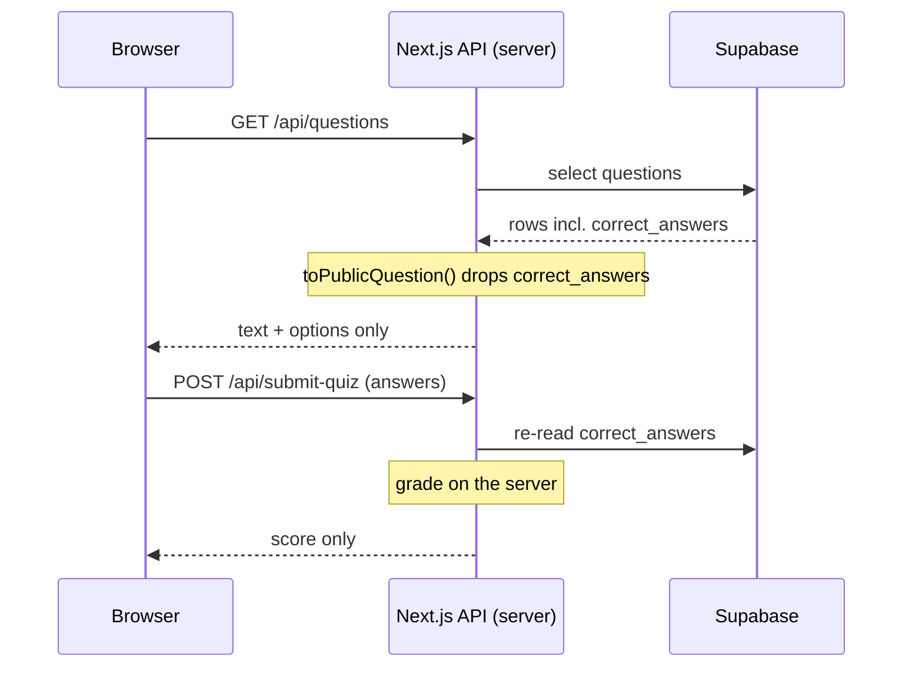

<div align="center">

# Quiz Engine

**A multiplayer-ish trivia game where the answers never reach the browser.**

[](https://nextjs.org)
[](https://www.typescriptlang.org)
[](https://supabase.com)
[](https://22nd-birthday-quiz.vercel.app)

</div>

A three-round trivia app built for a birthday party, where friends competed for
a prize. That detail matters, because it set the actual engineering constraint:
**the players were developers**, and anyone who opened DevTools, read the
network tab, or cloned the repository should still not be able to win.

So the design rule was that a correct answer must never exist on the client.

## How the answers stay secret

Most quiz tutorials ship the answer key to the browser and compare in
JavaScript, which means the answers are one `view-source` away. This one splits
the question in half at the API boundary.



1. **`lib/to-public-question.ts`** strips `correct_answers` from every row
   before it is serialised, so the payload the browser receives is incapable of
   revealing the answer.
2. **`lib/grading.ts`** runs only inside the API route. Submissions are graded
   server-side against a fresh read from the database.
3. **Row Level Security is enabled with no public policies**
   (`supabase/rls-deny-policies.sql`). Guessing the table name from the anon key
   gets you nothing; the service-role key is used exclusively on the server.
4. The client store (`store/quiz-store.ts`) holds progress and selections, never
   correctness.

The result is that the only way to learn an answer is to be the database or the
server. That is the whole point of the project.

## Features

- Three rounds (easy, moderate, difficult) with multiple-choice and free-text
  questions, graded case-insensitively after trimming.
- Server-authoritative scoring with a results reveal and confetti.
- A password-gated `/admin` dashboard showing live submissions.
- Session handling so a refresh does not restart a run.
- Optional background music, off by default.
- Responsive, animated UI with Framer Motion and Tailwind CSS v4.

## Tech stack

| Area | Choice |
| :--- | :--- |
| Framework | Next.js 16 (App Router) |
| Language | TypeScript |
| Styling | Tailwind CSS v4 |
| Animation | Framer Motion |
| State | Zustand |
| Database | Supabase (Postgres + RLS) |
| Hosting | Vercel |

## Getting started

**Prerequisites:** Node.js 18+, npm, and a free [Supabase](https://supabase.com)
project.

```bash
git clone https://github.com/gecapistrano/quiz-engine.git
cd quiz-engine
npm install

cp .env.local.example .env.local
```

Fill in `.env.local`:

| Variable | Purpose |
| :--- | :--- |
| `NEXT_PUBLIC_SUPABASE_URL` | Supabase project URL |
| `NEXT_PUBLIC_SUPABASE_ANON_KEY` | Anon key (kept for the template; the app does not read the DB from the client) |
| `SUPABASE_SERVICE_ROLE_KEY` | **Server only.** Used by the API routes and the seeder |
| `ADMIN_PASSWORD` | Gate for `/admin` |
| `NEXT_PUBLIC_MUSIC_SRC` | Optional. Path to a background track, e.g. `/audio/theme.mp3` |

Then set up the database and run it:

```bash
# In the Supabase SQL editor, run in order:
#   supabase/schema.sql
#   supabase/rls-deny-policies.sql

npm run seed     # loads questions into Supabase
npm run dev      # http://localhost:3000
```

### Writing your own questions

`npm run seed` reads `scripts/questions.local.ts` if it exists and
`scripts/questions.example.ts` otherwise. Since the local file contains the
answer key, it is gitignored:

```bash
cp scripts/questions.example.ts scripts/questions.local.ts
# edit scripts/questions.local.ts, then:
npm run seed
```

The seeder upserts on `order_index`, so re-running it updates existing questions
rather than duplicating them.

## Routes

| Route | Purpose |
| :--- | :--- |
| `/` | Landing page |
| `/quiz` | Gameplay |
| `/results` | Score reveal |
| `/admin` | Live submissions, password gated |

## Audio

No audio file ships with this repository. Drop your own into `public/audio/`
and point `NEXT_PUBLIC_MUSIC_SRC` at it; without that variable the app runs
silent. Please use music you have the right to distribute —
[Free Music Archive](https://freemusicarchive.org) and
[Musopen](https://musopen.org) are good sources.

## License

[MIT](LICENSE)
